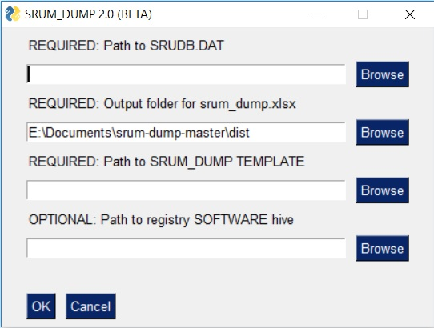

## SRUM-DUMP2

SRUM Dump extracts information from the System Resource Utilization Management Database and creates a Excel spreadsheet. 

The SRUM is one of the best sources for applications that have run on your system in the last 30 days and is invaluable to your incident investigations! 

To use the tool you will need a copy of the SRUM (located in c:\windows\system32\sru\srudb.dat, but locked by the OS).

This tool also requires a SRUM_TEMPLATE that defines table and field names. You can optionally provide the SOFTWARE registry hive and the tool will tell you which wireless networks were in use by applications.

If you are looking for a version of this tool that creates CSV files instead of an Excel spreadsheet, dumps targeted tables or processes any ese then check out [ese2csv.](https://github.com/MarkBaggett/ese-analyst)  ese2csv.exe is designed specifically for csv files with the CLI user in mind.

TO RUN THE TOOL :

Please Download both srum_dump2.exe and SRUM_TEMPLATE2.XLSX. Place them in the same directory and double click srum_dump2.exe
If you want to analyze the system that SRUM_DUMP is running on (Live Aquisition) then it must be running as an administrator. 

To run from Source Code:
To run from source you will need this code and some third party modules that it depends upon. One of those modules is libesedb-python. Installation of the libesedb-python module on a Windows system is difficult, but its easy on Linux. Windows instructions are below.  On Linux..

    git clone --branch srum_dump2 http://github.com/markbaggett/srum-dump
    cd srum-dump
    sudo -H python3 -m pip install -r requirements.txt

## Program Features

You may provide all of the options from the command line. If the name of a srum file is not passed then the GUI will launch.  There are some features like live acquisition that are only available in the GUI when run as an administrator.

In addition to the GUI srum-dump2 has the following enhancements over the original version.

 - Dump all fields tables including those that are not defined in the
   template XLSX.
 - LIVE System Aquisition when run as administrator
 - Speed Improved

The live acquisition warning dialog box will appear if you select the file **c:\Windows\system32\sru\srudb.dat**.  This file is locked by the OS and can not be directly accessed. From here you can easily download a copy of FGET to acquire an unlocked copy of the file. If, and only if, **you are an administrator** a button will appear that says "AUTO EXTRACT".  

If you click this button then it will download FGET from my github and acquire a copy of both the SRUDB.DAT file and the associated SOFTWARE registry hive. Then it will set the paths in the GUI so that points to the acquired copies in a temporary directory.

Removed Features: 
I have removed the capability of defining calculated fields in the template.

The srum_template2.xlsx file is a way of defining friendly names and formats for fields found in ESE databases. To understand its power try to dump your srum with BLANK_TEMPLATE.XLSX and compare the results.The format row in the template tells srum to process fields and resolve their values. Some formats such as "lookup_SID" and "lookup_LUID" are hardcoded functions in srum_dump. You can suppliment the built in know SIDS with those form your investigation by adding them to the lookup-Known Sids sheet. ESE fields can be resolved dynamically when the format row contain "lookup-xlssheet-name".  You can Add XLS tabs containing lookup tables then add srum-dump will use it to resolve values in ese tables if their table has the name of the lookup table in format row (see lookup-ExampleNameNums) 

## Windows Installation:

The only thing you really need to quickly get started is srum-dump2.exe and the srum-template2.xlsx.  See the "To Run the Tool" above.   However, if you want to run it from source you will have to install a few modules including libesedb-python. Installing libesedb-python on a windows system is hard because it requires a compiler be present and configured correctly. The matter is confused by the fact that error messages give incorrect requirements about old versions of build tools. To compile from source follow these instructions.

 1. Install Visual C++ build tools. This is not the same as the full
    visual studio install. Download the lates version from Microsoft. 
    Google "Visual C++ build tools". These links were accurate when I
    wrote this:
    
    https://go.microsoft.com/fwlink/?LinkId=691126
    
    https://download.microsoft.com/download/5/f/7/5f7acaeb-8363-451f-9425-68a90f98b238/visualcppbuildtools_full.exe
    
    When prompted by the installer select ALL OF THE OPTIONAL PACKAGES.
    Do you really need all of them? No, but depending upon what your
    doing its hard to say what you will need. Just install them all.
    
 2. Then install Python 3.  I installed Python 3.7.4.  Once again,
    select ALL the options including installing precompiled libraries,
    debug symbols, etc.  Again, you don't really need all of them for
    this specific project but you may for other projects so it nice to
    have a complete install for building libraries.
    
    Next update pip and setuptools. For this project you will also need
    several additional modules.  Install them like this: 
    
    pip install --upgrade pip 
    pip install --upgrade setuptools pip
    install libesedb-python 
    pip install openpyxl 
    pip install python-registry 
    pip install pyinstaller 
    pip install pysimplegui

